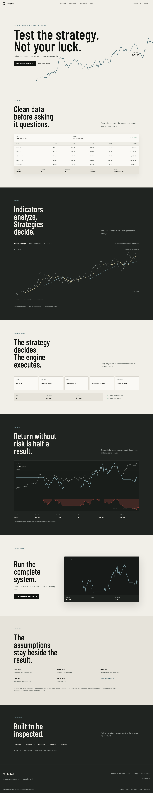
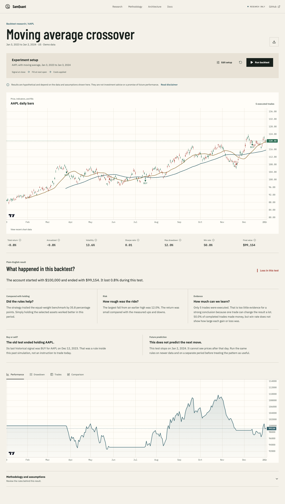
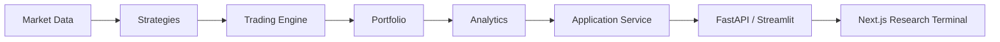

# SamQuant

[](https://github.com/samanyuahuja/SamQuant/actions/workflows/ci.yml)

[](LICENSE)

**A transparent algorithmic-trading system with a tested Python engine and a
purpose-built quantitative research interface.**

SamQuant turns validated market data into strategy signals, executes those
signals with delayed next-open fills, tracks portfolio accounting and trading
costs, calculates risk metrics, and presents the results in an interactive
dashboard. A FastAPI boundary serves the Next.js research terminal without
duplicating financial logic in TypeScript. It is an education project, not a
claim of future profitability.





## Highlights

- Downloads, validates, and locally caches adjusted daily OHLCV data.
- Supports US, Indian NSE, and Indian BSE symbols through Yahoo Finance.
- Implements moving-average crossover, mean-reversion, and momentum strategies.
- Simulates long-only multi-asset portfolios with fees and adverse slippage.
- Executes every signal at the following bar's open to avoid same-bar leakage.
- Reports return, volatility, Sharpe ratio, drawdown, and realized win rate.
- Explains each result in plain language without turning old signals into trading advice.
- Compares strategies against an equal-weight benchmark in Streamlit.
- Presents a responsive Next.js terminal with real SamQuant charts and exports.
- Keeps deterministic public demos separate from opt-in local Yahoo downloads.
- Runs deterministic tests without depending on live network data.

## Architecture



Each layer owns one responsibility. The dashboard orchestrates public APIs but
does not contain strategy, execution, or analytics logic. See the
[architecture guide](docs/architecture.md) for module boundaries and the full
decision-to-execution timeline.

## Quick Start

SamQuant supports Python 3.10 and newer.

```bash
git clone https://github.com/samanyuahuja/SamQuant.git
cd SamQuant
python3 -m venv .venv
source .venv/bin/activate
python -m pip install -r requirements-dev.txt
cd web && npm install && cd ..
```

Start the Python API and public web app in separate terminals:

```bash
source .venv/bin/activate
SAMQUANT_ENABLE_YAHOO=true python -m uvicorn samquant.api.app:app --reload
```

```bash
cd web
npm run dev
```

Open `http://localhost:3000`. The terminal starts with deterministic SamQuant
results, while the local API command above also enables Yahoo Finance downloads.
Keep `SAMQUANT_ENABLE_YAHOO` unset on a public deployment unless its data policy
allows provider access. The Streamlit prototype remains available with
`python -m streamlit run samquant/dashboard/app.py`.

Indian symbols can be entered without provider suffixes:

- NSE: `RELIANCE, TCS, INFY` becomes `RELIANCE.NS, TCS.NS, INFY.NS`.
- BSE: `RELIANCE, TCS, INFY` becomes `RELIANCE.BO, TCS.BO, INFY.BO`.

See the [usage guide](docs/usage.md) for every dashboard input and a complete
Python example.

## Python Example

```python
from samquant.analytics import calculate_metrics
from samquant.data.market_data import get_ohlcv
from samquant.engine import Backtester
from samquant.strategies import MovingAverageCrossoverStrategy

market_data = {
    "AAPL": get_ohlcv("AAPL", start="2020-01-01", end="2025-01-01")
}
strategy = MovingAverageCrossoverStrategy(short_window=50, long_window=200)
target_weights = strategy.generate_target_weights(market_data)

result = Backtester(
    initial_cash=100_000,
    commission_rate=0.001,
    slippage_bps=5,
).run(market_data, target_weights)

metrics = calculate_metrics(result)
print(metrics.total_return, metrics.sharpe_ratio, metrics.maximum_drawdown)
```

## Research Integrity

For a signal calculated after bar `t` closes, SamQuant shifts the target by one
bar and first permits execution at bar `t+1`'s open. Tests also change future
prices and verify that earlier signals remain unchanged.

The simulator includes configurable commissions, fixed fees, and adverse
slippage. Yahoo downloads use adjusted OHLC prices by default so stock splits
and distributions do not create artificial price jumps. Adjusted and unadjusted
requests use different cache files.

Important limitations remain:

- The selected asset list is not a point-in-time index universe, so careless
  universe selection can introduce survivorship bias.
- Fills do not model volume limits, bid-ask spreads, market impact, latency,
  taxes, or partial execution.
- Strategies are examples for testing system design, not validated alpha claims.
- Results are in-sample unless the researcher creates an out-of-sample process.

## Strategies And Metrics

| Component | Current behavior |
| --- | --- |
| Moving average | Long when the short rolling mean exceeds the long rolling mean |
| Mean reversion | Enter below an entry z-score and exit after recovery |
| Momentum | Rank trailing returns and equal-weight the strongest assets |
| Benchmark | Buy and hold equal weights across the selected assets |
| Analytics | Total and annualized return, volatility, Sharpe ratio, maximum drawdown, win rate |

## Repository Structure

```text
samquant/
├── data/          # OHLCV download, validation, and caching
├── strategies/    # Market data to target portfolio weights
├── engine/        # Orders, portfolio accounting, and backtesting
├── analytics/     # Performance and risk calculations
├── application/   # Shared research use cases
├── api/           # Validated HTTP boundary
└── dashboard/     # Streamlit presentation
web/               # Next.js public site and research terminal
tests/             # Unit, integration, causality, and UI smoke tests
docs/              # Architecture, API, usage, and portfolio material
```

## Development

```bash
python -m pip install -r requirements-dev.txt
ruff check --select E4,E7,E9,F,B --ignore B905 samquant tests
pytest --cov=samquant --cov-report=term-missing --cov-fail-under=85
cd web
npm run lint && npm run typecheck && npm test && npm run build
npm run test:budget && npm run test:e2e
```

GitHub Actions checks Python 3.10 and 3.12, the production web build, bundle
budgets, accessibility, and 1440, 1024, 768, and 375 pixel browser journeys.

## Documentation

- [Usage and installation](docs/usage.md)
- [Architecture and design decisions](docs/architecture.md)
- [Important public APIs](docs/api.md)
- [Elevator pitch, resume bullets, and interview notes](docs/portfolio.md)
- [Web design system and asset plan](docs/web-design-system.md)
- [Web quality, accessibility, and performance report](docs/web-quality-report.md)

## Version 2 Candidates

Multi-asset optimization, point-in-time universes, walk-forward validation,
position sizing, stop-loss rules, Monte Carlo analysis, paper trading, and broker
integration are intentionally deferred until the Version 1 research foundation
is stable.

## License

SamQuant is available under the [MIT License](LICENSE).
