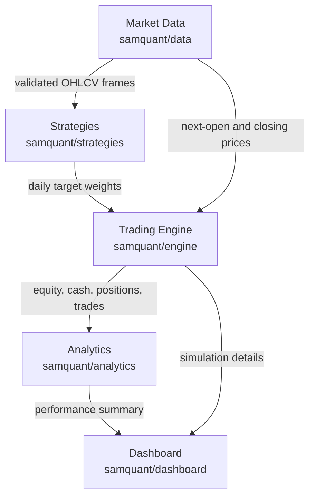
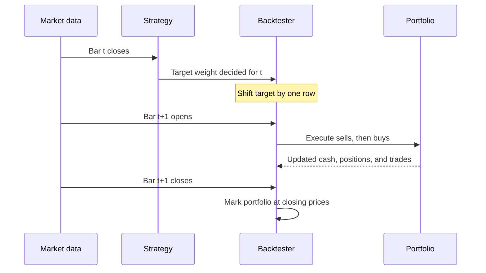

# SamQuant Architecture

## System Flow

## Module Responsibilities

| Module | Owns | Does not own |
| --- | --- | --- |
| `data` | Downloading, schema normalization, validation, CSV caching | Signals or trading decisions |
| `strategies` | Converting historical closes into target portfolio weights | Orders, fees, fills, or metrics |
| `engine` | Delayed execution, orders, cash, positions, fees, slippage, valuation | Data downloading or strategy rules |
| `analytics` | Validated calculations from completed backtest results | Signal generation or trade execution |
| `dashboard` | User inputs, orchestration, charts, and tables | A second copy of domain logic |

This dependency direction keeps the financial rules testable without starting
Streamlit. A strategy can be replaced without changing accounting, and the user
interface can be replaced without rewriting research logic.

## Decision-To-Execution Timeline

The strategy may use bar `t`'s close because execution cannot occur until the
next bar opens. It cannot use any value from `t+1` when making the decision.

## Important Design Decisions

### Target weights are the strategy-engine contract

Strategies describe desired exposure instead of creating orders. This keeps
signal research independent from commissions, available cash, and execution
rules. A future strategy only needs to return an aligned `DataFrame` of weights.

### Accounting has one owner

`Portfolio` is the only class that mutates cash and positions. Orders and trades
are immutable records, which makes executions easier to audit and test.

### Data is strict at domain boundaries

OHLCV frames must be non-empty, chronological, unique, numeric, complete, and
internally consistent. Provider-specific incomplete rows are removed only at the
download boundary; downstream modules continue to reject malformed inputs.

### Execution is intentionally conservative

The engine is long-only, fully invested at most, executes sales before purchases,
caps buys to available cash, and applies adverse slippage. Fractional quantities
keep Version 1 accounting deterministic and focused.

### The dashboard is an adapter

`dashboard/pipeline.py` converts controls into domain objects and prepares view
data. `dashboard/app.py` renders Streamlit components. Neither file duplicates
strategy or portfolio formulas.

## Current Boundaries

Version 1 assumes aligned daily bars, a user-selected universe, complete fills,
and no short selling or leverage. Point-in-time universes, corporate-action cash
flows, market impact, partial fills, and broker connectivity belong in Version 2.
